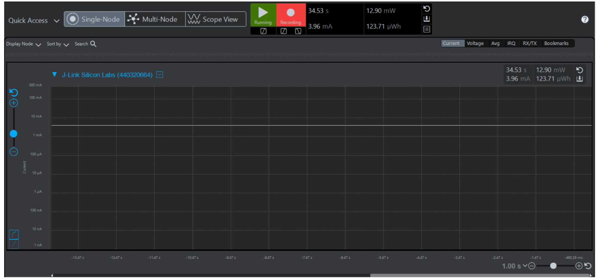
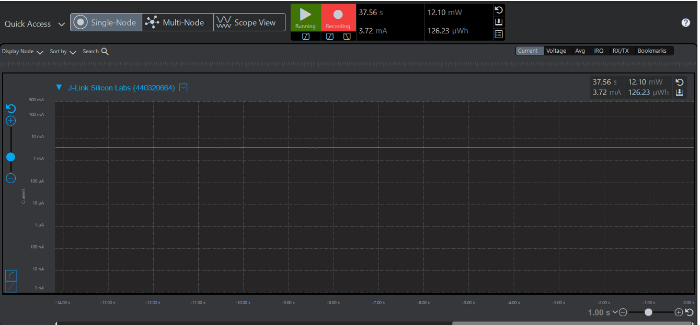

# MATLAB CNN Optimization for EFM32 MCU Deployment

Maintained by: Yash Daniel Ingle

The project focuses on optimizing a digit-classification CNN in MATLAB for MCU deployment on the EFM32GG11 platform. The workflow combines baseline CNN training, structured pruning, post-training quantization, and embedded profiling to study the tradeoff between validation accuracy, model size, Flash/RAM usage, and energy per inference.

## Overview

The CNN is designed for 28x28 grayscale digit images. The baseline model is trained in MATLAB using SGDM, then optimized with L1-norm structured pruning to remove redundant channels. After pruning, the workflow applies 8-bit post-training quantization using MATLAB `dlquantizer` with calibration and validation data.

The embedded validation context uses the EFM32GG11 MCU platform with Simplicity Studio and Commander Tool profiling. The project compares Flash usage, RAM usage, and energy consumption before and after optimization.

## Why This Project Matters

Embedded ML is not only about getting a model to run. It is about making the model fit within real hardware limits: memory, storage, energy, and deployment tooling. This project connects CNN optimization in MATLAB with hardware-aware validation for an MCU-class target.

## System Workflow

```text
28x28 grayscale digit images
    |
    v
Train baseline CNN in MATLAB using SGDM
    |
    v
Evaluate baseline accuracy
    |
    v
Compute L1-norm filter importance
    |
    v
Apply structured pruning to redundant channels
    |
    v
Retrain and evaluate pruned model
    |
    v
Run post-training 8-bit quantization
    |
    v
Validate quantized model
    |
    v
Compare accuracy, model size, Flash, RAM, and energy
    |
    v
Review EFM32GG11 profiling screenshots
```

## Repository Structure

```text
.
|-- README.md
|-- LICENSE
|-- requirements.md
|-- src/
|   `-- pruning_quantization_digitsNet.m
|-- results/
|   |-- README.md
|   |-- metrics_summary.csv
|   |-- ProfilingBeforePruning.png
|   |-- ProfilingAfterPruning.png
|   |-- pruning_accuracy_trend.png       (generated when the MATLAB workflow is run)
|   `-- layer_filter_pruning.png        (generated when the MATLAB workflow is run)
|-- docs/
|   |-- methodology.md
|   |-- profiling_notes.md
|   |-- diagnostic_state_machine_concept.md
|   `-- original_README.md
`-- models/
    `-- README.md
```

## Tools and Technologies

    - MATLAB
    - MATLAB Deep Learning Toolbox workflows
    - SGDM-based CNN training
    - L1-norm structured pruning
    - `dlquantizer`, `calibrate`, and `validate` for post-training quantization
    - EFM32GG11 MCU deployment context
    - Simplicity Studio and Commander Tool profiling context
    - Flash/RAM profiling and energy profiling
    - Embedded ML, model optimization, and resource-constrained systems

## Methodology

The MATLAB workflow in `src/` follows the original coursework optimization pipeline:

    1. Build and train a 3-layer CNN for 28x28 grayscale digit classification.
    2. Train the baseline network using SGDM.
    3. Evaluate baseline accuracy using prediction and validation-label comparison.
    4. Identify convolution, batch normalization, and fully connected layers.
    5. Compute filter importance using L1 norm.
    6. Apply structured pruning to remove redundant convolution channels.
    7. Update Conv2D and BatchNorm layers during pruning.
    8. Adjust downstream Conv2D input channels after filters are removed.
    9. Reinitialize or update the fully connected layer as required by the pruning workflow.
    10. Retrain the pruned network and evaluate accuracy after each pruning iteration.
    11. Run post-training 8-bit quantization using MATLAB `dlquantizer`.
    12. Calibrate and validate the quantized model using calibration and validation data.
    13. Save generated model and quantization artifacts locally under `models/`.

Generated `.mat` artifacts are kept out of version control to keep the repository lightweight. See `models/README.md` for the model artifact convention.

## Key Functions

| Function or API | Role |
| --- | --- |
| `trainDigitDataNetwork(imdsTrain, imdsValidation)` | Trains the baseline CNN using SGDM and saves `digitsNet.mat`. |
| `computeL1Pruning(weights, prune_ratio)` | Computes L1-norm filter importance for pruning. |
| `pruneNetwork(net, convIndices, bnIndices, fcIndex, pruneFilters)` | Updates Conv2D, BatchNorm, downstream layer connections, and fully connected layer handling after pruning. |
| `evaluateAccuracy(dlnet, mbq, classes, trueLabels)` | Compares predictions with validation labels to measure accuracy. |
| `dlquantizer`, `calibrate`, `validate` | Perform post-training quantization and validation. |

## Results

The results show the embedded tradeoff targeted by the project: pruning and quantization reduced model size, Flash usage, RAM usage, and energy per inference while retaining over 92% validation accuracy.

| Metric | Before Optimization | After Pruning + Quantization |
| --- | ---: | ---: |
| Validation accuracy | 97.5% | 92.1% |
| Model size | 27.5 KB | 18.3 KB |
| Flash usage | 23.4 KB | 16.2 KB |
| RAM usage | 7.2 KB | 4.9 KB |
| Energy per image | 7.43 µJ | 4.91 µJ |
| Sparsity achieved | 0% | 90% |

The energy per inference decreased from 7.43 µJ to 4.91 µJ, while the optimized model retained 92.1% validation accuracy.

## Profiling Screenshots

Flash/RAM usage and energy consumption were compared before and after optimization in the EFM32GG11 / Simplicity Studio / Commander Tool profiling context.

Before pruning and quantization:



After pruning and quantization:



## How to Run

1. Open MATLAB from the repository root.
2. Add `src` to the MATLAB path.
3. Run the main workflow:

```matlab
run('src/pruning_quantization_digitsNet.m')
```


## My Contributions

- MATLAB pruning/quantization workflow.
- Model evaluation before and after optimization.
- Flash/RAM/accuracy/energy tradeoff analysis.
- Documentation and profiling comparison.
- Cleanup for portfolio use.

## Engineering Takeaways

- Model optimization for MCU deployment requires more than accuracy tracking.
- Structured pruning helps reduce redundant channels in a way that is easier to map to embedded inference workflows.
- Quantization depends on representative calibration and validation data.
- Flash/RAM profiling and energy profiling are important parts of hardware-aware validation.
- Embedded ML workflows benefit from clear separation between source code, generated artifacts, measured results, and documentation.
- Resource-constrained systems force practical tradeoffs that are easy to miss in desktop-only ML experiments.

## Future Improvements

- Add a reproducible MATLAB setup script for dataset loading and path configuration.
- Add a sample inference workflow that can run without hardware.
- Expand embedded build documentation around the EFM32GG11 workflow.
- Re-run Flash/RAM profiling and energy profiling with versioned tooling and recorded hardware conditions.
- Explore the future MCU diagnostic state-machine concept described in `docs/diagnostic_state_machine_concept.md`.

## License

This project is released under the MIT License. See `LICENSE` for details.
